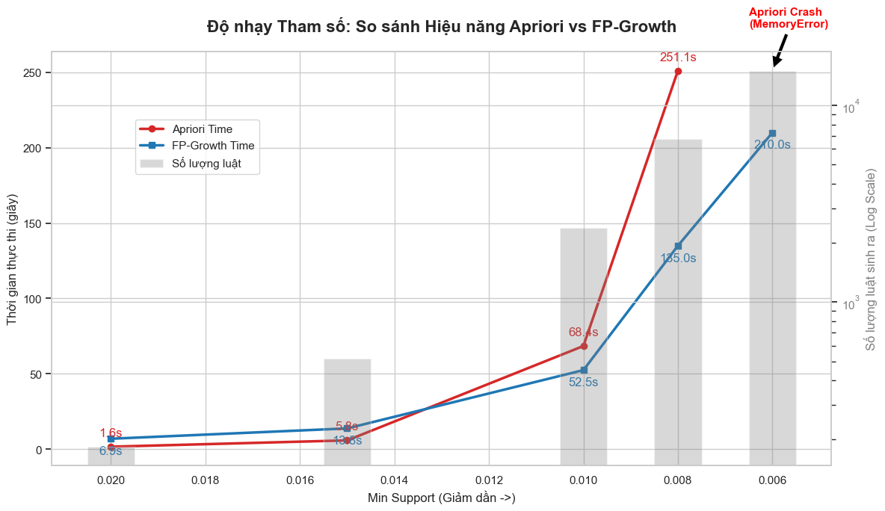
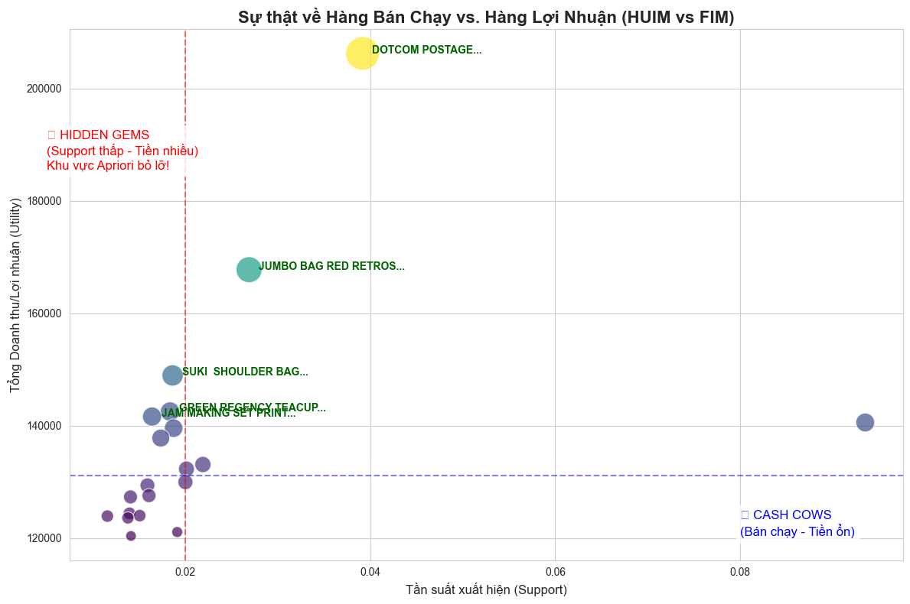
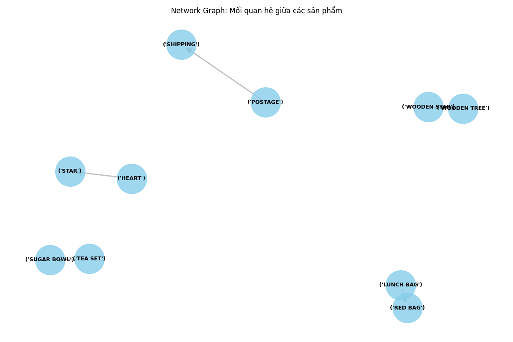
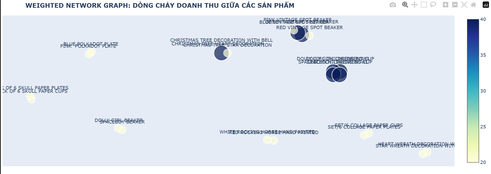
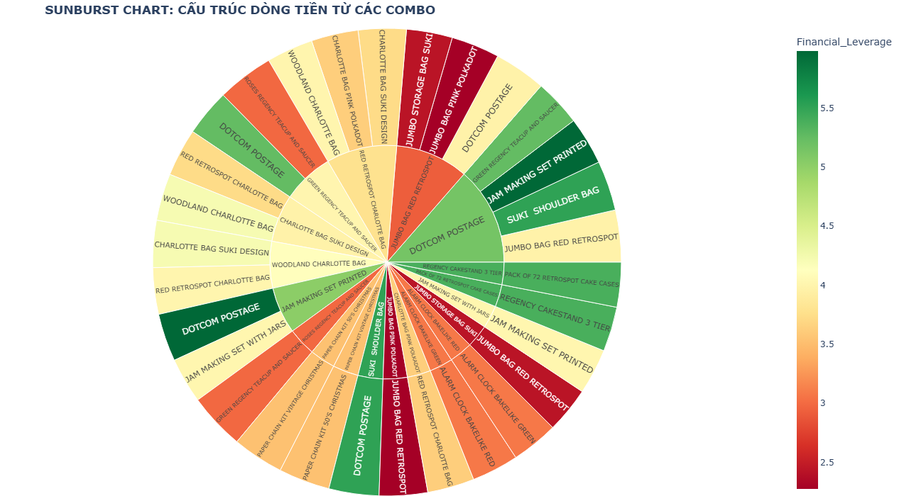
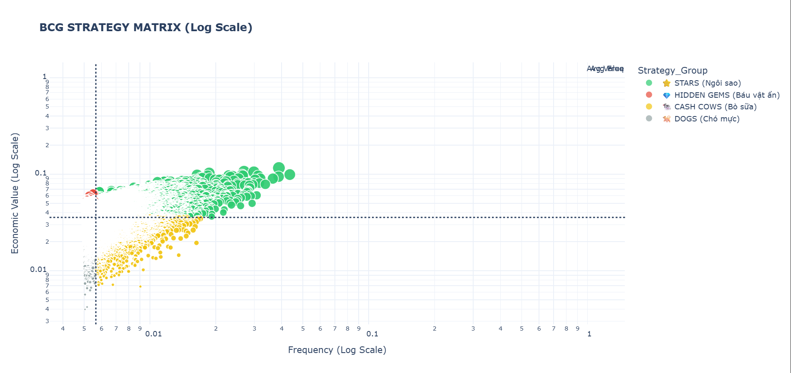
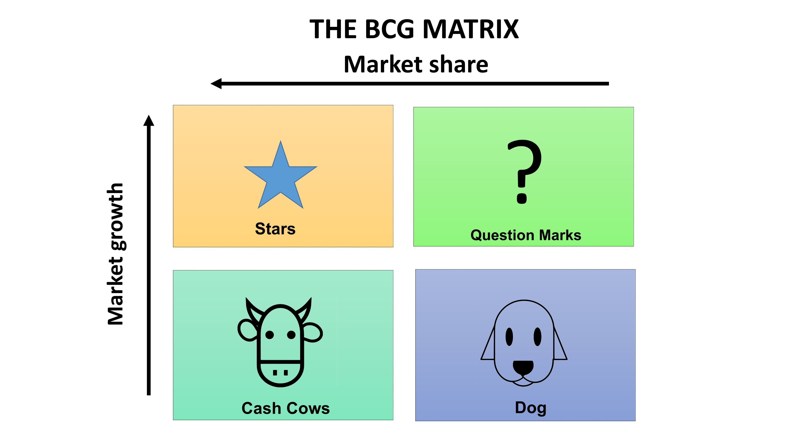

# 🛒 Market Basket Analysis: Khi Tốc độ gặp Lợi nhuận
# Frequent vs. High-Utility: Cuộc chiến giữa "Số Lượng" và "Chất Lượng"
> **"Dữ liệu không nói dối, nhưng cách chúng ta đặt câu hỏi (Tần suất hay Lợi nhuận) sẽ quyết định câu trả lời đáng giá bao nhiêu tiền."**

 
--
Dự án này thực hiện phân tích giỏ hàng (Market Basket Analysis) trên bộ dữ liệu bán lẻ thực tế (**UK Online Retail**). Điểm nhấn của dự án là sự chuyển dịch tư duy từ **Khai phá tập phổ biến (Frequent Itemset Mining)** truyền thống sang **Khai phá tập giá trị cao (High-Utility Itemset Mining - HUIM)** để tối ưu hóa doanh thu thực tế.
> **Case Study:** Online Retail Dataset (UCI)  
> **Chủ đề:** So sánh Apriori vs. FP-Growth & Đột phá tư duy với High-Utility Mining  
> **Thực hiện bởi:** Nhóm 3 - WL (Win for Life)

## 👥 Thông tin Nhóm
| Vai trò | Thành viên | 
| :--- | :--- | 
| **Leader** | [Nguyễn Văn Vinh] | 
| **Member** | [Bạch Ngọc Lương] |
| **Member** | [Đỗ Văn Vinh] | 
| **Member** | [Lại Thành Đoàn] | 
---

## 📑 Mục lục
1. [Giới thiệu](#1 giới-thiệu)
2. [Kế hoạch thực nghiệm & mỏ ngọc ẩn](#kế-hoạch-thực-nghiệm-&-mỏ-ngọc-ẩn)
3. [Kết luận và đề xuất chiến lược kinh doanh](#kết-luận-và-đề-xuất-chiến-lược-kinh-doanh)
---
# 1 Giới thiệu
## Cuộc chiến Apriori & FP-Growth

Dự án áp dụng mô hình so sánh giữa phương pháp truyền thống và phương pháp hiện đại để làm nổi bật hiệu quả xử lý dữ liệu lớn.

### 1. Thuật toán Apriori (Baseline Model)
> **Vai trò:** Tham chiếu (Benchmark) để so sánh hiệu năng.

Đây là thuật toán cổ điển nhất trong khai phá luật kết hợp.
* **Nguyên lý:** Sử dụng chiến lược tìm kiếm theo chiều rộng (**Breadth-First Search**) và nguyên lý **"Apriori Property"**: *Nếu một tập hợp là phổ biến thì tất cả các tập con của nó cũng phải phổ biến.*

**Cơ chế hoạt động:**
1.  **Join (Kết nối):** Tạo ra các tập ứng viên kích thước $k+1$ từ các tập phổ biến kích thước $k$.
2.  **Prune (Cắt tỉa):** Loại bỏ các tập ứng viên có tập con không phổ biến để giảm không gian tìm kiếm.
3.  **Count (Đếm):** Quét toàn bộ cơ sở dữ liệu để đếm tần suất xuất hiện.

⚠️ **Nhược điểm:** Trong dự án này, khi giảm `min_support` xuống thấp (0.6%), Apriori tạo ra hàng triệu ứng viên ảo, gây **tràn bộ nhớ (Memory Error)** và thời gian chạy tăng theo cấp số nhân.

---

### 2. Thuật toán FP-Growth (Core Model)
> **Vai trò:** "Động cơ" chính của Pipeline xử lý dữ liệu UK Online Retail.

Khác với Apriori, FP-Growth giải quyết bài toán nút thắt cổ chai về bộ nhớ và tốc độ.
* **Nguyên lý:** Thay vì sinh ứng viên (Candidate Generation), FP-Growth sử dụng cấu trúc cây nén dữ liệu gọi là **FP-Tree (Frequent Pattern Tree)**.

**Cơ chế hoạt động:**
1.  **Dựng cây (Tree Construction):** Nén toàn bộ cơ sở dữ liệu vào một cây FP-Tree, giữ nguyên thông tin về tần suất liên kết nhưng loại bỏ sự dư thừa.
2.  **Đệ quy (Divide and Conquer):** Chia bài toán lớn thành các bài toán nhỏ dựa trên "Cơ sở mẫu điều kiện" (Conditional Pattern Base) và khai phá trực tiếp trên cây.

✅ **Ưu điểm vượt trội:**
* Chỉ cần quét cơ sở dữ liệu **2 lần** (so với $k$ lần của Apriori).
* Tốc độ nhanh gấp hàng chục lần ở các ngưỡng support thấp.
* Tiết kiệm bộ nhớ RAM tối đa.
### ⚔️ So sánh thuật toán: Apriori vs FP-Growth

| Đặc điểm | Apriori (Cổ điển) | FP-Growth (Hiện đại) |
| :--- | :--- | :--- |
| **Cơ chế** | Sinh ứng viên & Kiểm tra (Join & Prune) | Dựng cây nén dữ liệu (FP-Tree) |
| **Quét dữ liệu** | $k$ lần (Rất nhiều) | **2 lần duy nhất** |
| **Hiệu năng** | Chậm, tốn bộ nhớ khi dữ liệu lớn | **Nhanh, tối ưu bộ nhớ** |
| **Kết quả Project** | Bị lỗi tràn RAM ở Support 0.6% | Chạy ổn định và nhanh chóng |
| **Kết luận** | Không phù hợp cho Big Data | **Lựa chọn tối ưu cho dự án này** |

## 3.High-Utility Itemset Mining (HUIM)
### 1. Khái niệm
**High-Utility Itemset Mining (HUIM)** là một kỹ thuật khai phá dữ liệu nâng cao, mở rộng từ bài toán Khai phá tập phổ biến (Frequent Itemset Mining - FIM).

* **Thuật toán truyền thống (Apriori, FP-Growth):** Chỉ trả lời câu hỏi *"Sản phẩm nào xuất hiện nhiều nhất?"*.
* **HUIM:** Tập trung trả lời câu hỏi quan trọng hơn đối với doanh nghiệp: **"Bộ sản phẩm nào mang lại nhiều lợi nhuận nhất?"**.

### 2. Tại sao cần HUIM? (Điểm mù của thuật toán cũ)
Các thuật toán dựa trên tần suất (Support-based) như Apriori có hai giả định sai lầm trong kinh doanh thực tế:

1.  **Giả định đồng nhất:** Coi mọi mặt hàng đều có giá trị như nhau.
    * *Ví dụ:* Một chiếc nhẫn kim cương (💎) được coi là 1 item, ngang bằng với một chiếc kẹo mút (🍭).
2.  **Giả định nhị phân:** Chỉ quan tâm khách có mua hay không (0/1), bỏ qua số lượng mua.
    * *Ví dụ:* Khách mua 100 gói mì tôm cũng chỉ được tính là 1 lần xuất hiện.

> ⚠️ **Hệ quả:** Doanh nghiệp có thể tối ưu hóa cho những sản phẩm bán chạy nhưng biên lợi nhuận thấp (như Túi nilon, Bút bi) mà bỏ lỡ những **"mỏ vàng"** là các sản phẩm bán ít nhưng lãi cao (như Trang sức, Set quà tặng).

### 3. Nguyên lý hoạt động
HUIM đánh giá tầm quan trọng của một tập sản phẩm (Itemset) dựa trên hai yếu tố:
* **Tiện ích nội tại (Internal Utility):** Số lượng sản phẩm khách hàng mua trong một giao dịch (`Quantity`).
* **Tiện ích ngoại lai (External Utility):** Lợi nhuận hoặc đơn giá của sản phẩm đó (`Unit Price` / `Profit`).

**Công thức tính độ hữu ích (Utility):**

Độ hữu ích của một mặt hàng $i$ trong giao dịch $T$ được tính bằng:
$$u(i, T) = quantity(i, T) \times unit\_price(i)$$

Độ hữu ích của một tập hợp $X$ trong toàn bộ cơ sở dữ liệu $D$:
$$u(X) = \sum_{T \in D, X \subseteq T} \sum_{i \in X} u(i, T)$$

*Nếu $u(X) \ge min\_utility$ (ngưỡng do người dùng đặt), thì $X$ được gọi là **High-Utility Itemset**.*

### 4. Ví dụ minh họa
Giả sử có 2 sản phẩm:
* **A (Bánh mì):** Giá $1, bán được 1000 cái. ➔ Tổng thu: **$1,000**.
* **B (Rượu vang):** Giá $200, bán được 10 chai. ➔ Tổng thu: **$2,000**.

| Thuật toán | Đánh giá (Góc nhìn) | Kết quả |
| :--- | :--- | :--- |
| **Apriori / FP-Growth** | Chỉ nhìn số lượng (1000 vs 10). | Chọn **Bánh mì**, loại bỏ Rượu vang (vì coi là nhiễu). |
| **High-Utility Mining** | Nhìn tổng tiền ($1000 vs $2000). | Chọn **Rượu vang** là sản phẩm quan trọng hơn. |
---
## 💡 Ý Tưởng Dự Án: "Đừng Nhìn Số Lượng - Hãy Nhìn Vào Ví Tiền"

Hãy tưởng tượng bạn là chủ một tiệm tạp hóa. Cuối tháng, bạn ngồi tính sổ xem món nào là *"con gà đẻ trứng vàng"*.

### 📉 1. Cách cũ (Apriori/FP-Growth): "Lấy thịt đè người"
Thuật toán này giống như một cuộc thi hoa hậu bình dân. Nó chỉ quan tâm: **"Đứa nào xuất hiện nhiều nhất thì đứa đó thắng!"**.

* **Kết quả nó báo:** 🗣️ *"Sếp ơi! **Túi nilon** và **Tăm xỉa răng** là mặt hàng quan trọng nhất vũ trụ! Ngày nào cũng có 100 người mua!"*
* **Thực tế đắng lòng:** Mỗi bịch tăm lời được... 500 đồng. Bán cả tháng không đủ tiền đóng tiền điện.
* **Vấn đề:** Thuật toán này bị **"mù giá trị"**. Với nó, bán được 1 chiếc **Nhẫn Kim Cương** (xuất hiện 1 lần) cũng chỉ bằng bán 1 gói **Mì Tôm** (xuất hiện 1 lần).

👉 **Kết luận:** Cách này chỉ giỏi tìm ra những món *"ai cũng mua"* nhưng *"lời chẳng bao nhiêu"*.

---

### 💰 2. Cách mới (High-Utility Mining): Tư duy "Shark Tank"
Nhóm chúng em thấy cách cũ "ngây thơ" quá, nên quyết định nâng cấp tư duy. Chúng em không đếm số lần khách mua nữa, mà đếm **tổng tiền khách trả**.

> **Tư duy:** "Anh không quan tâm em xuất hiện bao nhiêu lần, anh chỉ quan tâm em mang về cho anh bao nhiêu tiền."

**Ví dụ thực tế trong dự án:**
Có một món tên là **"Bộ Làm Mứt" (Jam Making Set)**. Cả tháng mới có vài vị khách "nữ công gia chánh" ghé mua.

| Góc nhìn | Phản ứng | Kết quả |
| :--- | :--- | :--- |
| **Cách cũ** | ❌ Đá ra "chuồng gà" vì ế. | Mất đi khách VIP. |
| **Cách mới** | ✅ Hóa ra mấy chị mua bộ này toàn là "đại gia"! Mua bộ làm mứt xong mua thêm nồi niêu xoong chảo xịn. | **Mỏ vàng đây rồi!** Một đơn hàng lời bằng bán tăm cả năm. |

---

### 🎯 3. Tóm lại là...
Dự án của Nhóm 3 giống như việc chuyển từ **bán trà đá** (lấy số lượng bù chất lượng) sang **bán đá quý** (bán ít nhưng ăn dày).

**Mục tiêu:** Giúp doanh nghiệp không bị đánh lừa bởi những con số ảo, tìm ra đúng những khách hàng *"ít nói mà làm sướng cái bụng"* để chăm sóc tận răng!

---
## 🛠 Pipeline Xử lý
Chúng tôi áp dụng quy trình **Hybrid Approach**:
1.  **Tiền xử lý:** Làm sạch đơn hủy, lọc dữ liệu rác từ `online_retail.csv`.
2.  **Lọc ứng viên:** Dùng FP-Growth với `min_support` thấp (0.5%) để tìm tất cả các tập hợp tiềm năng.
3.  **Tính toán Utility:** Áp dụng hàm trọng số: 
            $Utility = \sum (Quantity \times UnitPrice)$.
4.  **Xếp hạng:** So sánh Top Frequent vs. Top Utility.
---
# 2. Kế hoạch thực nghiệm & mỏ ngọc ẩn
## Cuộc đua hiệu năng
## ⚖️ Thực nghiệm & So sánh Hiệu năng (Q2)
Qua thực nghiệm thực tế trên tập dữ liệu 18,021 hóa đơn, chúng tôi rút ra các nhận định quan trọng về độ nhạy tham số:

| Ngưỡng Support | Apriori Time | FP-Growth Time | Trạng thái |
| :--- | :--- | :--- | :--- |
| **0.02 (2%)** | ~1.65 giây | ~6.93 giây | Apriori nhanh hơn ở ngưỡng cao. |
| **0.01 (1%)** | **68.44 giây** | **52.45 giây** | FP-Growth bắt đầu vượt trội. |
| **0.008 (0.8%)** | 251.11 giây | 134.97 giây | Sự chênh lệch hiệu năng rõ rệt. |
| **0.006 (0.6%)** | **FAILED** | **210 giây** | Apriori lỗi `MemoryError` (Yêu cầu >15GB RAM). |

**Kết luận**: FP-Growth là giải pháp tối ưu cho "mẫu đuôi dài" (long-tail patterns) - những luật có support thấp nhưng mang lại giá trị insight sâu sắc[cite: 77, 95].

---
## Thí nghiệm thế kỷ
## ⚔️ Thực nghiệm 1: Apriori vs FP-Growth

Chúng tôi đã kiểm tra độ nhạy tham số của hai thuật toán bằng cách giảm dần ngưỡng `min_support`.

### Kết quả hiệu năng:
| Ngưỡng Support | Apriori Time | FP-Growth Time | Luật sinh ra | Kết luận |
| :--- | :--- | :--- | :--- | :--- |
| **0.02** | ~2.24s | ~7.20s | 218 | Apriori nhanh hơn ở tập dữ liệu thưa. |
| **0.015** | 5.38s | 13.69s | 738 | FP-Growth bắt đầu vượt trội. |
| **0.01** | 79.33s | **78.57s** | 4376 | FP-Growth bắt đầu vượt trội. |
| **0.008** | 269.13s | **201.89s** | 12876 | FP-Growth vượt trội hơn rõ rệt. |

**Nhận xét:** Apriori không có khả năng mở rộng (non-scalable) khi cần đào sâu vào dữ liệu (support thấp) do bùng nổ tổ hợp ứng viên. FP-Growth với cấu trúc cây nén là lựa chọn bắt buộc cho Big Data.

---

## 💎 Thực nghiệm 2: High-Utility Mining (Advanced)

> *Đây là phần mở rộng nâng cao nhằm tối ưu hóa theo Lợi nhuận (Utility) thay vì Tần suất (Support).*

### Vấn đề của phương pháp truyền thống
Các thuật toán như FP-Growth thường bỏ qua các sản phẩm giá trị cao nhưng ít người mua (Support thấp).

### Kết quả đối chứng (Mindset Shift)
Chúng tôi đã tìm ra sự khác biệt lớn giữa Top sản phẩm bán chạy (Frequent) và Top sản phẩm lợi nhuận (High-Utility):

*(Biểu đồ Scatter Plot cho thấy vùng "Hidden Gems" - nơi Support thấp nhưng Utility cực cao)*

| Xếp hạng | Top Tần Suất (Support) | Top Giá Trị (Utility) | Ý nghĩa |
| :--- | :--- | :--- | :--- |
| **#1** | *White Hanging Heart T-Light* | **DOTCOM POSTAGE** | Doanh thu Online (Phí ship) là nguồn thu khổng lồ. |
| **#2** | *Regency Cakestand 3 Tier* | **Jumbo Bag + Postage** | Combo túi cỡ lớn + Ship đi tỉnh. |
| **#3** | *Jumbo Bag Red Retrospot* | **Regency Cakestand 3 Tier** | Sản phẩm "Ngôi sao" toàn diện. |
| **#4** | *Party Bunting* | **Jam Making Set (Support 1.6%)** | **Mỏ vàng bị bỏ quên!** |

## 🎨 Giải Mã "Bản Đồ Kho Báu": Khi Hàng Hóa Đi Thi Hoa Hậu

Nhìn vào biểu đồ **Scatter Plot**, đừng hoang mang! Hãy tưởng tượng đây là một **Sân Khấu Casting** của các món hàng trong siêu thị, và chúng ta là Ban Giám Khảo đang chấm điểm.

Sân khấu này chia làm 2 trục:
* ➡️ **Trục Ngang (Độ Nổi Tiếng):** Càng nằm về bên phải là càng "Hot", ai cũng biết, ai cũng mua. Kiểu như *"Hoa hậu thân thiện"*.
* ⬆️ **Trục Dọc (Độ Cá Kiếm):** Càng nằm lên cao là càng mang về nhiều tiền. Kiểu như *"Đại gia ngầm"*.

Và đây là 4 gương mặt tiêu biểu trên sân khấu:

### 1. Team "Hot Girl Trà Sữa" (Góc Phải - Dưới) 🥤
* **Đặc điểm:** Rất nổi tiếng (nằm phải) nhưng tiền ít (nằm dưới).
* **Đại diện:** *Túi nilon, Thiệp chúc mừng*.
> **Lời bình:** Mấy em này đi đâu cũng gặp, ai cũng mua. Nhưng khổ nỗi bán 1.000 cái mới lãi được bằng tiền mua ổ bánh mì.
>
> 👉 **Kết luận:** *"Nổi tiếng nhưng viêm màng túi".* Nuôi quân 3 năm dùng 1 giờ, mà giờ dùng xong vẫn đói.

### 2. Team "Chủ Tịch Giả Nghèo" (Góc Trái - Trên) 🕵️‍♂️💎
* **Đặc điểm:** Ít ai biết (nằm trái) nhưng tiền cực nhiều (nằm trên).
* **Đại diện:** **Bộ Làm Mứt (Jam Making Set)**.
> **Lời bình:** Đây chính là nhân vật chính! Cả tháng mới thò mặt ra một lần, nhìn lầm lì ít nói. Nhưng hễ "chốt đơn" một phát là bằng cả xóm bán hàng cộng lại. Khách mua món này toàn là "cá mập", mua xong là mua thêm cả núi đồ bếp xịn.
>
> 👉 **Kết luận:** *"Ít nói nhưng làm nhiều. Đừng thấy em ít xuất hiện mà tưởng em nghèo!"*

### 3. Team "Con Nhà Người Ta" (Góc Phải - Trên) 🌟
* **Đặc điểm:** Vừa bán chạy (Hot) lại vừa lãi to (Rich).
* **Đại diện:** **Khay Bánh 3 Tầng (Regency Cakestand)**.
> **Lời bình:** Đẹp trai, học giỏi, nhà mặt phố, bố làm to.
>
> 👉 **Kết luận:** *"Gánh team còng lưng".* Đây là trụ cột gia đình, cấm được đụng vào!

### 4. Trùm Cuối (Cái chấm cao nhất) 👑
* **Đại diện:** **Phí Ship (DOTCOM POSTAGE)**.
> **Sự thật ngỡ ngàng:** Hóa ra đứa giàu nhất cái bản đồ này không phải là hàng hóa, mà là... **ông shipper**.
>
> 👉 **Bài học:** Muốn giàu, hãy làm dịch vụ vận chuyển cho người giàu!

---

### 💡 Tóm lại bức tranh này nói lên điều gì?
* Nếu bạn chỉ nhìn theo **Trục Ngang** (cách cũ), bạn sẽ tôn vinh mấy em "Hot Girl Trà Sữa" và đuổi cổ anh "Chủ Tịch Giả Nghèo".
* Nhờ có **High-Utility Mining**, chúng ta mới phát hiện ra anh **Chủ Tịch (Bộ làm mứt)** đang trốn trong góc và mời anh ra ngồi ghế VIP!

---

## 📊 Trực quan hóa 
### 🔗 Sơ Đồ Mạng Lưới (Network Graph)

* **Mục tiêu:** Xác định các cặp sản phẩm thường xuyên được mua cùng nhau (dựa trên chỉ số Support/Confidence).
* **Phát hiện chính:** Nhận diện các liên kết cơ bản nhưng bền vững như `SHIPPING - POSTAGE`, `WOODEN STAR - WOODEN TREE`, và `SUGAR BOWL - TEA SET`.
* **Ứng dụng:** Cơ sở cho các chiến dịch **Bán chéo (Cross-selling)** đơn giản.
---
### 💎 Đồ Thị Mạng Trọng Số (Weighted Network Graph)

* **Mục tiêu:** Tích hợp yếu tố doanh thu/lợi nhuận vào các mối liên kết mạng lưới.
* **Phát hiện chính:** * Các nút màu xanh đậm (trọng số 35-40) thể hiện các cụm mang lại giá trị kinh tế cực lớn, điển hình là bộ ba sản phẩm **Beaker (Pink, Blue, Red Vintage Spot)**.
    * Cụm đồ dùng trẻ em (**Dolly Girl** & **Spaceboy**) cho thấy dòng chảy doanh thu ổn định khi được bán theo bộ.
* **Ứng dụng:** Xác định các **Gói sản phẩm (Product Bundles)** cao cấp để tối ưu hóa doanh thu.
---
### ☀️ Biểu Đồ Sunburst: Cấu Trúc Dòng Tiền & Đòn Bẩy

* **Mục tiêu:** Phân tích phân cấp các combo sản phẩm và hiệu quả tài chính thông qua chỉ số **Financial Leverage**.
* **Phát hiện chính:**
    * **Đòn bẩy cao (Xanh đậm ~5.5):** Các combo có sự góp mặt của `DOTCOM POSTAGE` kết hợp cùng `JAM MAKING SET PRINTED` hoặc `SUKI SHOULDER BAG` mang lại hiệu quả lợi nhuận tốt nhất.
    * **Vùng cảnh báo (Đỏ/Cam ~2.5):** Một số combo phổ biến nhưng lại có đòn bẩy tài chính thấp, cần cân nhắc điều chỉnh giá hoặc chi phí vận hành.
---
## 💎 Đánh giá Luật theo Giá trị Kinh doanh
Không chỉ dừng lại ở các chỉ số đếm thông thường, dự án tập trung vào **Chủ đề 3: Đánh giá dựa trên Lift và Trọng số**:

### 1. Ma trận chiến lược BCG (BCG Matrix)

Thay vì chỉ nhìn vào sản phẩm nào bán được nhiều nhất, chúng tôi phân loại sản phẩm vào 4 nhóm chiến lược để có cách ứng xử phù hợp:

* **🌟 Nhóm Ngôi Sao (Stars):** Những sản phẩm vừa bán chạy, vừa mang lại lợi nhuận cao. Đây là nguồn thu chính cần được bảo vệ.
* **💎 Nhóm Báu Vật Ẩn (Hidden Gems):** Những mặt hàng ít người mua nhưng mỗi đơn hàng lại cực kỳ giá trị. Đây là những cơ hội tăng trưởng bị bỏ lỡ nếu chỉ nhìn vào số lượng bán.
* **🐄 Nhóm Bò Sữa (Cash Cows):** Những sản phẩm bán rất nhiều nhưng lợi nhuận trên mỗi món thấp. Chúng đóng vai trò kéo khách hàng đến với cửa hàng.
* **🐕 Nhóm Cần Xem Xét (Dogs):** Những sản phẩm yếu cả về doanh số lẫn lợi nhuận, cần xem xét loại bỏ để tối ưu kho bãi.

### 2. Trọng số Doanh thu (Weighted Support)
Thay vì đếm số lần xuất hiện, chúng tôi gán trọng số dựa trên `InvoiceValue`[cite: 183, 194]. 
* **Insight**: Một số luật có tần suất xuất hiện thấp nhưng lại chủ yếu nằm trong các hóa đơn giá trị cao, xứng đáng được ưu tiên trong các chiến dịch Marketing dành cho khách hàng VIP.
## 💡 Insight Kinh doanh & Chiến lược
Dựa trên kết quả khai phá dữ liệu, Nhóm 3 đề xuất:

---

## 1. Khai Thác Nhóm "Hidden Gems" (Báu Vật Ẩn Giấu)
* **Insight:** Ma trận BCG xác định một nhóm sản phẩm có tần suất mua thấp nhưng mang lại giá trị kinh tế cực cao (vùng màu đỏ ở góc trái phía trên). Các mặt hàng như `SUKI SHOULDER BAG` hay `JAM MAKING SET PRINTED` đóng góp lợi nhuận rất lớn trên mỗi đơn vị bán ra dù ít khi xuất hiện đại trà.
* **Hành động Quản lý:** * Triển khai chiến dịch marketing cá nhân hóa (Email Marketing hoặc quảng cáo mục tiêu) dành riêng cho phân khúc khách hàng cao cấp.
    * Thay đổi tiêu chí đánh giá hiệu quả kinh doanh: Tập trung vào biên lợi nhuận thay vì chỉ nhìn vào số lượng đơn hàng cho nhóm này.

---

## 2. Tối Ưu Hóa "Combo Vàng" Theo Đòn Bẩy Tài Chính
* **Insight:** Biểu đồ Sunburst chỉ ra các kết hợp như `DOTCOM POSTAGE` với `JAM MAKING SET PRINTED` hoặc `SUKI SHOULDER BAG` đạt mức đòn bẩy tài chính (Financial Leverage) cao nhất (~5.5). Đây là những sự kết hợp tối ưu nhất về mặt dòng tiền cho doanh nghiệp.
* **Hành động Quản lý:** * Thiết lập chính sách **"Smart Bundling"**: Miễn phí hoặc giảm giá vận chuyển (`Postage`) khi khách hàng mua các combo thuộc nhóm có đòn bẩy tài chính cao.
    * Kích cầu mua sắm vào các nhóm sản phẩm có màu xanh đậm trên biểu đồ để tối đa hóa lợi nhuận thực tế trên mỗi giao dịch.

---

## 3. Tận Dụng Sự Gắn Kết Của Các Cặp "Bài Trùng"
* **Insight:** Chỉ số Lift khẳng định cặp `WOODEN STAR` và `WOODEN TREE` có sức mạnh kết hợp cao gấp ~15 lần mức bình thường. Đồ thị mạng trọng số cũng cho thấy bộ ly quai (**Beaker**) nhiều màu sắc tạo thành cụm doanh thu đậm đặc.
* **Hành động Quản lý:** * **Visual Merchandising:** Đặt các sản phẩm này cạnh nhau trên kệ hàng vật lý và khu vực "Gợi ý mua kèm" trên website.
    * **Sáng tạo SKU mới:** Tạo gói sản phẩm "Bộ sưu tập Beaker 3 màu" với giá ưu đãi để khuyến khích khách mua trọn bộ thay vì mua lẻ.

---

## 4. Chiến Lược Phân Cấp: "Cash Cows" và "Dogs"
* **Insight:** `REGENCY CAKESTAND 3 TIER` đóng vai trò là "Bò sữa" (Cash Cow) với độ phủ thị trường gần 10% nhưng lợi nhuận đơn lẻ không cao. Trong khi đó, nhóm "Dogs" (màu xám) đang gây lãng phí nguồn lực kho bãi.
* **Hành động Quản lý:** * Sử dụng nhóm Cash Cows làm sản phẩm mồi (**Loss Leader**) để thu hút lưu lượng khách hàng (Traffic).
    * Quyết liệt thanh lý hoặc tặng kèm nhóm "Dogs" để giải phóng không gian kho và tái đầu tư vốn vào các nhóm "Stars" hoặc "Hidden Gems".

---

## 5. Hệ Thống Hóa Quy Luật Mua Sắm Dựa Trên Độ Tin Cậy
* **Insight:** Biểu đồ Scatter Plot xác nhận các quy luật mua sắm có độ tin cậy (Confidence) ổn định từ 60% đến 90%. Điều này cho phép doanh nghiệp dự báo hành vi khách hàng với độ chính xác cao.
* **Hành động Quản lý:** * Tích hợp các luật kết hợp có độ tin cậy >80% vào hệ thống chatbot tư vấn tự động.
    * Đào tạo nhân viên bán hàng: Khi khách chọn `TEA SET`, bắt buộc gợi ý thêm `SUGAR BOWL` vì dữ liệu chứng minh tỉ lệ thành công cực cao.

---
#  3. KẾT LUẬN VÀ ĐỀ XUẤT CHIẾN LƯỢC KINH DOANH

Nghiên cứu này không chỉ dừng lại ở việc tìm ra các tập mục phổ biến mà còn đi sâu vào giá trị kinh tế thực tế, giúp chuyển đổi dữ liệu thô thành lợi nhuận chiến lược thông qua thuật toán **High-Utility Itemset Mining (HUIM)**.

---

## 1. Kết Luận Chung
Dựa trên các kết quả thực nghiệm, chúng tôi rút ra các kết luận quan trọng sau:

* **Sự khác biệt giữa Tần suất và Giá trị:** Các mặt hàng bán chạy nhất (như `REGENCY CAKESTAND 3 TIER`) thường có biên lợi nhuận thấp, trong khi các mặt hàng ít phổ biến hơn lại mang lại giá trị kinh tế cao hơn.
* **Nhận diện "Báu vật ẩn":** Thuật toán HUIM đã chứng minh ưu thế vượt trội khi tìm thấy nhóm **Hidden Gems** — những sản phẩm có tần suất mua thấp nhưng lợi nhuận đột phá, vốn bị các thuật toán truyền thống bỏ qua.
* **Độ tin cậy cao:** Hầu hết các luật kết hợp tìm được đều có độ tin cậy (Confidence) trên 60%, cho thấy hành vi mua sắm của khách hàng mang tính hệ thống và có thể dự báo.

---

## 2. Đề Xuất Chiến Lược Kinh Doanh

### 2.1. Quản Trị Danh Mục Theo Ma Trận BCG
Phân loại và xử lý sản phẩm dựa trên vị thế chiến lược của chúng:

| Nhóm Chiến Lược | Đặc Điểm | Chiến Lược Đề Xuất |
| :--- | :--- | :--- |
| **STARS** | Tần suất & Giá trị đều cao | Duy trì ngân sách Marketing, làm hạt nhân cho các chiến dịch quảng bá chính. |
| **HIDDEN GEMS** | Tần suất thấp, Giá trị cực cao | Cá nhân hóa quảng cáo, hướng tới khách hàng VIP để khai thác biên lợi nhuận lớn. |
| **CASH COWS** | Bán chạy, Giá trị trung bình | Sử dụng làm sản phẩm "mồi" để thu hút khách hàng đến cửa hàng. |
| **DOGS** | Thấp về cả tần suất & giá trị | Thanh lý xả kho hoặc dùng làm quà tặng kèm để giải phóng không gian lưu kho. |

### 2.2. Chiến Lược Đóng Gói (Bundling) & Bán Chéo (Cross-selling)
Tối ưu hóa giỏ hàng bằng cách tận dụng các mối liên kết mạng lưới:

* **Combo "Bài trùng":** Thiết kế các gói sản phẩm cố định cho các cặp có chỉ số Lift cao như `WOODEN STAR` và `WOODEN TREE` để kích cầu.
* **Khai thác cụm doanh thu:** Bán theo bộ (Collection) cho các nhóm sản phẩm có màu xanh đậm trong đồ thị mạng trọng số như bộ sưu tập Beaker (Pink, Blue, Red).
* **Gợi ý thông minh:** Tích hợp luật kết hợp vào hệ thống "Sản phẩm gợi ý" để tự động mời khách mua thêm các món đồ có tính bổ trợ cao như `TEA SET` và `SUGAR BOWL`.

### 2.3. Tối Ưu Hóa Đòn Bẩy Tài Chính (Financial Leverage)
Tập trung vào các nhóm sản phẩm mang lại hiệu quả sử dụng vốn tốt nhất:

* **Ưu tiên Đòn bẩy cao:** Đẩy mạnh truyền thông cho các combo nằm ở vùng màu xanh đậm trên biểu đồ Sunburst (Leverage ~5.5) như `DOTCOM POSTAGE` đi kèm `JAM MAKING SET PRINTED`.
* **Chiến lược Phí vận chuyển:** Sử dụng dịch vụ vận chuyển làm công cụ mồi nhử. Miễn phí vận chuyển cho các giỏ hàng chứa các mặt hàng High-Utility để tăng tổng biên lợi nhuận trên mỗi đơn hàng.

---

## 3. Lời Khuyên Cho Nhà Quản Trị
Để tối ưu hóa lợi nhuận trong kỷ nguyên dữ liệu lớn, doanh nghiệp cần chuyển dịch tư duy từ **"Bán nhiều nhất"** sang **"Bán hiệu quả nhất"**. Việc định kỳ thực hiện phân tích HUIM sẽ giúp nhà quản trị:
1. Phát hiện sớm các xu hướng tiêu dùng giá trị cao.
2. Cấu trúc lại danh mục sản phẩm theo hướng tinh gọn và lợi nhuận.
3. Giảm thiểu rủi ro tồn kho từ các nhóm sản phẩm không hiệu quả (Dogs).

---
## Link code & note book
- Notebook : nhom3.ipynb, nhom3_nangcao.ipynb, run_papermill.py
- Repo  : https://github.com/VINH1811/shopping_cart_advanced_analysis.git
- web : https://vinh1811.github.io/lab2-datamining/
---
## Link slide 
- link : 
