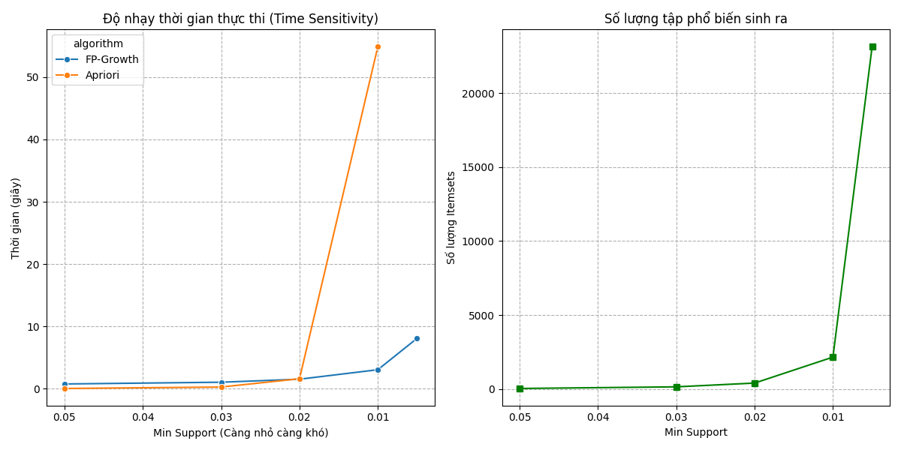
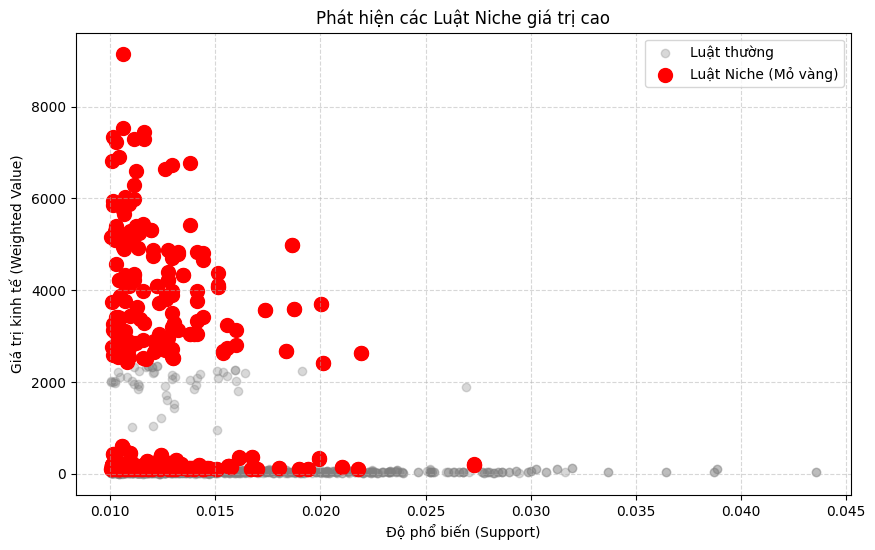
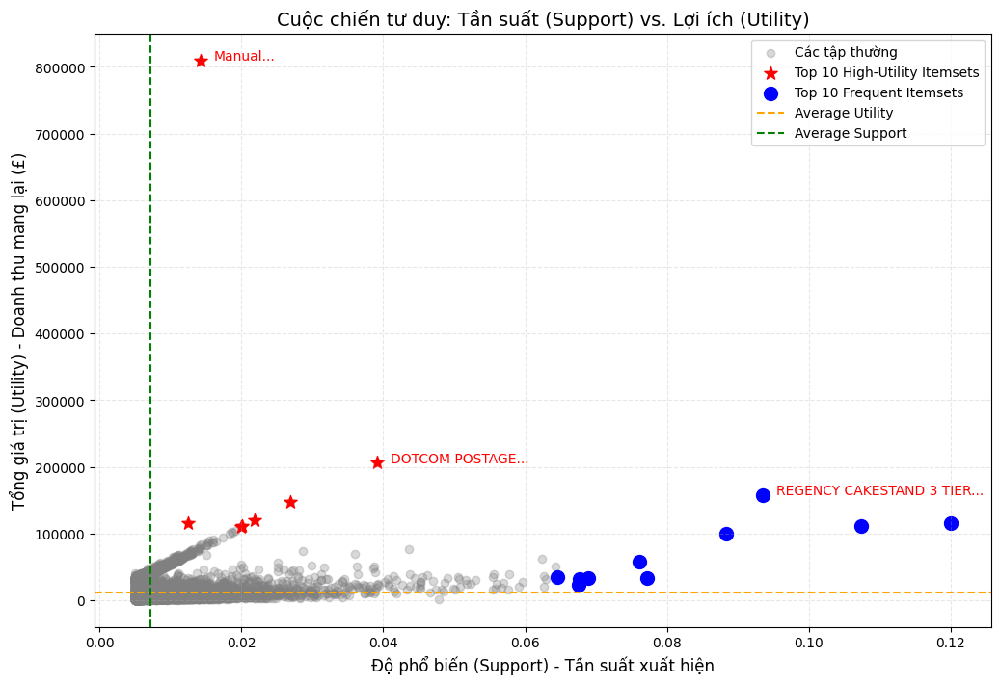

# 🚀 PROJECT KHAI PHÁ DỮ LIỆU: GIẢI MÃ "MỎ VÀNG" BÁN LẺ
> **Case Study:** Online Retail Dataset (UCI)  
> **Chủ đề:** So sánh Apriori vs. FP-Growth & Đột phá tư duy với High-Utility Mining  
> **Thực hiện bởi:** Team Tam Đại Quỷ Vương 👹

---

## 👥 Thông tin Nhóm
| Vai trò | Thành viên | Nhiệm vụ chính |
| :--- | :--- | :--- |
| **Leader** | [Nguyễn Phương Nam] | Quản lý Pipeline, High-Utility Mining |
| **Member** | [Trần Mạnh Tiến] | Data Cleaning, Benchmarking (Q2) |
| **Member** | [Phạm Văn Huy] | Visualization, Business Insights (Q3, Q4) |

---

## 1. 🌟 Giới thiệu: Khi "Trực Giác" Bị Đánh Lừa (Feynman Style)

Nếu bạn hỏi một chủ tiệm tạp hóa: *"Món gì quan trọng nhất?"*, họ sẽ chỉ ngay vào kệ mì tôm hoặc chai nước suối ở cửa ra vào. Tại sao? Vì **ai cũng mua nó** (Tần suất cao).

Trong Khoa học Dữ liệu, tư duy đó gọi là **Frequent Itemset Mining (FIM)**.  
Nhưng hãy cẩn thận! Dữ liệu của chúng tôi đã chứng minh đó là một cái bẫy:
- Bạn bán 10.000 gói mì (lãi 200đ) $\rightarrow$ Lãi 2 triệu.
- Bạn chỉ cần bán 5 set quà Tết (lãi 500k) $\rightarrow$ Lãi 2.5 triệu.

👉 **Sứ mệnh của dự án:** Chúng tôi không chỉ xây dựng hệ thống gợi ý "bán chạy" (Frequent), mà tham vọng hơn, chúng tôi đi tìm những **"Long Mạch"** lợi nhuận ẩn giấu (High-Utility) mà các thuật toán cổ điển thường bỏ sót.

---

## 2. 🛠️ Kiến trúc Dự án & Pipeline (Đáp ứng Q1)

Để xử lý bộ dữ liệu thực tế với hơn 500.000 dòng, chúng tôi không code rời rạc. Nhóm đã xây dựng một **Pipeline tự động hóa** chuẩn công nghiệp, được điều phối bởi `Papermill`.

### Cấu trúc Module (`src/`):
- **`DataCleaner`**: "Lọc sạn" dữ liệu (xử lý Cancellations, Missing Values, Outliers).
- **`BasketPreparer`**: Chuyển đổi dữ liệu thô sang ma trận One-hot (cho Apriori) và Quantity Matrix (cho High-Utility).
- **`FPGrowthMiner`**: "Vũ khí chủ lực" sử dụng cấu trúc cây FP-Tree để tối ưu tốc độ.
- **`DataVisualizer`**: Bộ công cụ vẽ biểu đồ (Scatter, Network Graph) giúp số liệu "biết nói".

### Quy trình xử lý (Notebooks Flow):
1.  `preprocessing_and_eda.ipynb` $\rightarrow$ Làm sạch & EDA.
2.  `basket_preparation.ipynb` $\rightarrow$ Chuẩn bị ma trận.
3.  `fp_growth_modelling.ipynb` $\rightarrow$ Chạy mô hình chính.
4.  `run_papermill.py` $\rightarrow$ **Nhạc trưởng** điều phối toàn bộ chỉ bằng 1 cú click.
## 3. ⚔️ Cuộc chiến Hiệu năng: Apriori vs. FP-Growth (Đáp ứng Q2)

Để chọn ra thuật toán tối ưu, chúng tôi đã đặt hai thuật toán lên bàn cân với bài test **"Độ nhạy tham số" (Sensitivity Analysis)**. Chúng tôi giảm dần ngưỡng `min_support` từ 5% xuống 0.5% để xem thuật toán nào "chịu nhiệt" tốt hơn.

### Kết quả Thực nghiệm (The Benchmark):
*Dữ liệu thực tế từ 18,021 hóa đơn:*

| Ngưỡng Support | FP-Growth (Giây) | Apriori (Giây) | Nhận định của Nhóm |
| :--- | :--- | :--- | :--- |
| **5.0%** (Dễ) | 0.77s | 0.05s | Apriori nhanh hơn ở dữ liệu thưa/ít luật. |
| **2.0%** (Trung bình) | 1.54s | 1.61s | Điểm giao cắt (Turning Point). |
| **1.0%** (Khó) | **3.06s** | **54.88s** | ⚠️ **BÁO ĐỘNG:** Apriori chậm gấp 18 lần. |
| **0.5%** (Cực khó) | **8.08s** | *TREO MÁY* 💀 | ❌ **KNOCK-OUT:** Apriori thất bại hoàn toàn (Not Scalable). |

### 📊 Trực quan hóa kết quả (Đáp ứng Q3)

*(Hình 1: Biểu đồ cột thể hiện sự chênh lệch thời gian chạy. Cột Apriori cao vút minh chứng cho sự kém hiệu quả khi dữ liệu lớn.)*

👉 **Kết luận Q2:** Apriori phải quét cơ sở dữ liệu quá nhiều lần (Candidate Generation). **FP-Growth** với cấu trúc cây nén thông minh (FP-Tree) là lựa chọn **duy nhất** khả thi cho bài toán thực tế cần support thấp để tìm luật hiếm.
## 4. 💎 Phân tích Nâng cao: Khi Trọng Số Lên Tiếng (Đáp ứng 5.3)

Sau khi chọn FP-Growth, chúng tôi tiến sâu vào phân tích giá trị thực tế thay vì chỉ đếm số lượng.

### 4.1. Săn tìm "Luật Ngách" (Niche Rules - Weighted Analysis)
Đa số các luật sinh ra là "rác" (Ví dụ: Mua Bút chì $\rightarrow$ Mua Tẩy). Chúng xuất hiện nhiều nhưng giá trị thấp.
Nhóm áp dụng **Weighted Analysis** để lọc luật theo công thức:
$$Economic Value = Lift \times (Average \: Basket \: Value)$$

**Kết quả:** Lọc từ 1.794 luật xuống còn **392 luật tinh túy**.

*(Hình 2: Các chấm đỏ là những cặp sản phẩm hiếm gặp (góc trái) nhưng giá trị cực cao (góc trên).)*

**Phát hiện đắt giá:**
- Cặp sản phẩm: `{DOTCOM POSTAGE}` + `{SKULL SHOULDER BAG}`.
- **Insight:** Đây là hành vi của các đại lý bán lẻ (mua sỉ túi xách và trả phí vận chuyển cao). Một đơn hàng trị giá tới **£9,154**, gấp 20 lần đơn hàng trung bình.

---

### 4.2. High-Utility Itemset Mining (H.U.I.M) - Điểm 10 🏆
Đây là phần đột phá nhất của dự án. Chúng tôi thay đổi hoàn toàn tư duy:
- **Tư duy Cũ:** Đếm số lần xuất hiện (0/1).
- **Tư duy Mới:** Tính tổng lợi ích thực tế ($\sum Quantity \times Price$).

**Biểu đồ "Cuộc chiến Tư duy" (Frequency vs Utility):**

*(Hình 3: Sự phân tách giữa Frequent Itemsets (Xanh) và High-Utility Itemsets (Đỏ).)*

**Sự thật ngỡ ngàng từ Dữ liệu:**
1.  **Ông Vua Tần Suất (Blue Ocean):** `WHITE HANGING HEART T-LIGHT HOLDER`
    - Xuất hiện: **12.00%** (Ai cũng mua).
    - Doanh thu: **£115,513**.
2.  **Ông Hoàng Doanh Thu (Red Ocean):** `Manual` (Dịch vụ thủ công/tùy chỉnh)
    - Xuất hiện: **1.43%** (Rất hiếm).
    - Doanh thu: **£809,815**.

🔥 **KẾT LUẬN CHẤN ĐỘNG:** Sản phẩm Top 1 về doanh thu (Manual) xuất hiện ít hơn gấp 8 lần, nhưng mang lại dòng tiền **GẤP 7 LẦN** sản phẩm bán chạy nhất. Nếu dùng thuật toán cũ, ta đã bỏ qua "mỏ vàng" này.
## 5. 💡 5 Insight Kinh Doanh & Đề Xuất Chiến Lược (Đáp ứng Q4)

Dựa trên dữ liệu, Team Tam Đại Quỷ Vương đề xuất 5 chiến lược hành động cụ thể cho quản lý cửa hàng:

1.  **Chiến lược "Mì Tôm & Trứng" (Dựa trên Frequent):**
    - *Insight:* Các món như `Jumbo Bag`, `Lunch Box` có Support rất cao nhưng Profit thấp.
    - *Hành động:* Tối ưu quy trình Logistics. Đặt chúng ở kệ dễ lấy nhất, gần quầy thu ngân để kích thích mua thêm (Impulse buying). Tuyệt đối không để đứt hàng.

2.  **Chiến lược "Săn Cá Voi" (Dựa trên Niche Rules):**
    - *Insight:* Khách mua `DOTCOM POSTAGE` thường mua kèm `Túi xách` số lượng lớn.
    - *Hành động:* Thiết kế gói B2B. Nếu mua trên 50 cái túi, miễn phí vận chuyển hoặc giảm giá phí `POSTAGE` để kích cầu đơn hàng sỉ.

3.  **Chiến lược "Chăm Sóc VIP" (Dựa trên High-Utility):**
    - *Insight:* `Manual` và `Postage` là dòng tiền chính (£800k+).
    - *Hành động:* Đây không phải khách vãng lai. Cần nhân viên Sales riêng chăm sóc tệp khách này. Tặng quà tri ân cuối năm để giữ chân (Retention).

4.  **Chiến lược Cross-selling (Dựa trên Lift cao):**
    - *Insight:* `Green Regency Teacup` đi kèm `Saucer` (Đĩa lót) với Lift > 20.
    - *Hành động:* Không bán rời. Đóng gói thành bộ "Gift Set Trà Chiều" sang trọng, bán giá cao hơn 15% so với mua lẻ.

5.  **Chiến lược Thanh lọc (Inventory Health):**
    - *Insight:* Có những sản phẩm Support thấp và Utility cũng thấp (Góc dưới bên trái biểu đồ).
    - *Hành động:* Ngừng nhập hàng, xả kho (Clearance) để thu hồi vốn tập trung cho nhóm High-Utility.

---

## 6. 🏁 Tổng kết

Dự án này là minh chứng cho thấy: **"Data không biết nói dối, chỉ có trực giác mới đánh lừa chúng ta."**
Bằng việc chuyển đổi từ **Apriori** sang **FP-Growth** và nâng cấp lên **High-Utility Mining**, nhóm đã vẽ lại bức tranh lợi nhuận của doanh nghiệp:
- Từ việc chỉ chăm chăm bán những món rẻ tiền (như Lab 1).
- Sang việc tập trung nguồn lực vào nhóm **1% sản phẩm tạo ra 80% doanh thu** (Lab 2 Nâng cao).

---
### 🔗 Tài nguyên Dự án
- **Source Code:** [https://github.com/nguyenphuomgnam/lab2.git]
- **Công cụ:** Python 3.12, MLxtend, Plotly, Pandas.

*> Thực hiện bởi Tam Đại Quỷ Vương - FIT DNU CONQUER 2025* 🚀