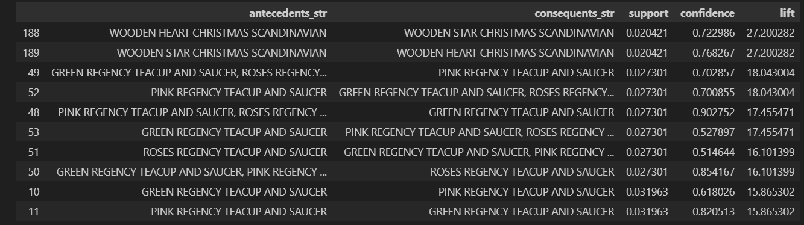
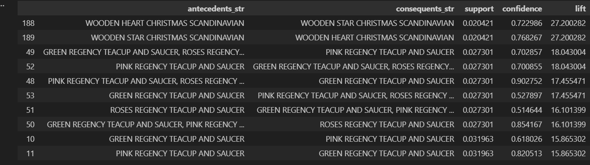

# Tóm tắt

- Vấn đề: So sánh hai thuật toán tìm tập phổ biến/luật kết hợp (Apriori và FP‑Growth) và đánh giá ảnh hưởng của việc gán trọng số theo giá trị hóa đơn lên các chỉ số luật (weighted_support, weighted_confidence, weighted_lift).
- Mục tiêu: Hiểu độ nhạy tham số (min_support, min_threshold) và thấy khác biệt giữa luật dựa trên tần suất và luật dựa trên giá trị (trọng số).
---

# Bài Toán & Dữ Liệu

- Dữ liệu: lịch sử giao dịch bán lẻ (InvoiceNo, InvoiceDate, Description, Quantity, UnitPrice, CustomerID). Tính TotalPrice = Quantity * UnitPrice cho mỗi dòng; dùng tổng TotalPrice theo hóa đơn làm trọng số.
- Output mong muốn: danh sách itemset và luật kết hợp, cùng các chỉ số truyền thống (support, confidence, lift) và các chỉ số có trọng số (weighted_support, weighted_confidence, weighted_lift) để so sánh.
## Pipeline (mạch xử lý)

- Bước 1 — Tiền xử lý: lọc hóa đơn hợp lệ, tính TotalPrice, lọc UK (nếu cần), tạo basket theo InvoiceNo × Description.
- Bước 2 — Chuyển sang basket_bool: mã hóa sự xuất hiện (quantity >= 1 => True).
- Bước 3 — Khai thác tập phổ biến:
Apriori: dễ hiểu, liệt kê tổ hợp tăng dần, nhưng có thể nổ combinatorial khi min_support rất nhỏ.
FP‑Growth: xây cây FP, thường nhanh hơn và tiết kiệm bộ nhớ khi dữ liệu lớn.
- Bước 4 — Sinh luật: từ frequent itemsets dùng association_rules để lấy các luật với metric (ví dụ lift) và ngưỡng (min_threshold).
- Bước 5 — Hậu xử lý trọng số: ghép bảng luật với thông tin hóa đơn để tính:
weighted_support(A∪B) = sum(weights of invoices containing A∪B) / total_weight
weighted_confidence = weighted_support(A∪B) / weighted_support(A)
weighted_lift = weighted_confidence / weighted_support(B)
(Đã implement trong module WeightedRulesAugmenter.)

augmenter = WeightedRulesAugmenter(transactions_df, invoice_col='InvoiceNo', item_col='Description', weight_col='TotalPrice')
rules_weighted = augmenter.augment_rules(rules_df)

Kết quả chính & trực quan (hướng dẫn phân tích)
(Phần này là khuôn mẫu báo cáo — sau khi chạy notebook, chèn kết quả cụ thể vào từng mục)

- Biểu đồ 1 — Thời gian chạy theo min_support (trục X giảm dần): so sánh runtime_sec của Apriori vs FP‑Growth. Kỳ vọng: Apriori tăng nhanh hơn khi min_support nhỏ.
- Biểu đồ 2 — Số lượng itemset và số lượng luật theo min_support: cho thấy độ nhạy tham số.
- Biểu đồ 3 — So sánh top‑10 luật theo lift (thông thường) và theo weighted_lift: bảng hai cột, mỗi hàng là một luật, cho thấy luật nào được nâng lên/hạ xuống khi xét trọng số.
Bảng tóm tắt các thống kê:
- Trung bình độ dài itemset, phân phối support/confidence/lift trước và sau trọng số.
- Số luật lọc được ở các ngưỡng khác nhau.
Insight mẫu (những điểm cần tìm khi quan sát kết quả thực tế):

- Nếu một luật có support thấp nhưng xuất hiện trong các hóa đơn có TotalPrice lớn thì weighted_lift có thể cao hơn so với lift — nghĩa là luật có ý nghĩa về doanh thu dù ít xuất hiện.
- FP‑Growth thường cho cùng số itemset/luật nhưng nhanh hơn; tuy nhiên kết quả về luật (với cùng ngưỡng support) phải giống nhau về mặt logic nếu implement đúng — khác biệt chính là hiệu năng.
- Apriori có thể bị “nổ tổ hợp” (combinatorial explosion) khi min_support nhỏ, dẫn đến thời gian và bộ nhớ tăng đột biến.
- Luật trọng số giúp kinh doanh: ưu tiên những kết hợp thường xuất hiện trong giao dịch có giá trị cao (ví dụ để đề xuất bundle hoặc cross‑sell cho khách có xu hướng chi tiêu lớn).
## So sánh & Kết luận — Dành cho người ra quyết định
- Hiệu năng:
FP‑Growth: ưu tiên nếu dataset lớn hoặc nếu cần chạy nhiều thí nghiệm với support nhỏ.
Apriori: dễ hiểu, tốt để dạy/giải thích thuật toán và với dataset nhỏ/medium.
- Độ nhạy tham số:
Cả hai nhạy với min_support: giảm min_support → tăng số itemset và luật; ảnh hưởng đến thời gian và chất lượng (nhiều luật rác).
min_threshold (cho metric) giúp lọc luật theo chất lượng (confidence/lift).
- Giá trị kinh doanh:
Luật truyền thống (theo tần suất) hợp cho các chiến dịch tăng tần suất mua (cross‑sell phổ biến).
Luật có trọng số (theo doanh thu) hợp cho tối ưu doanh thu: chọn các gợi ý/bundle cho khách có khả năng chi trả cao, hoặc để định vị sản phẩm cao cấp.

